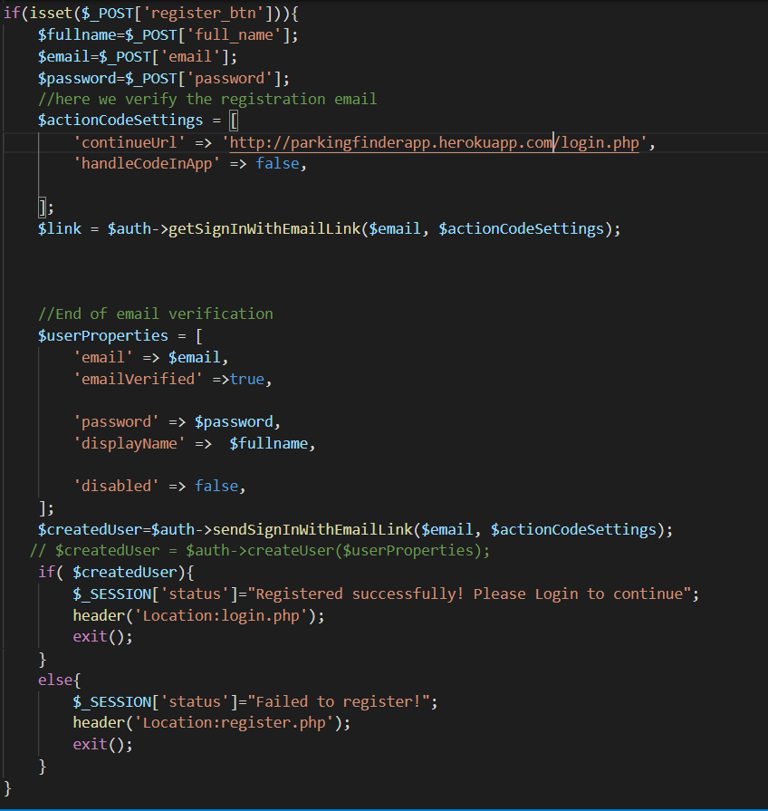

# A Smart System to Find Parking Spaces

## Project Overview
We all have had that conversation at some point in time where we either say or hear “Sorry, I can’t come to that place. It’s very difficult to find a parking space there”.

This is where parking apps come into the role. This apps perform the cumbersome task of finding near-by empty parking spaces and app users just need to reach there and park. 

### Note
 This is the administration module of the parking spot finder application. If you are interested in the client application, visit this link : https://github.com/AndroidCSPROJECT/ParkingFinder

 ## Project Description 
 The administration module enables the administrator to set up users management which allows users to be set up with definable access level/roles. The administrator can also set up overall system security settings such as inactivating or locking out accounts.

 ## Technologies Used

 - Html
   - Sematic elements, tags
   - Attributes
   - Best practices: indentation, file naming conventions and directory structure.

- CSS
   - Order of importance
   - Classes vs Ids
   - Selectors
   - Typography
   - Color: hexadecimal and RGB

- Php
   - Create
     - 
    if(isset($_POST['register_btn'])){
    $fullname=$_POST['full_name'];
    $email=$_POST['email'];
    $password=$_POST['password'];
    //here we verify the registration email
    $actionCodeSettings = [
        'continueUrl' => 'http://localhost/Parking%20Finder/Parking-Finder-Web/login.php',
        'handleCodeInApp' => false,
        
    ];
    $link = $auth->getSignInWithEmailLink($email, $actionCodeSettings);
    //End of email verification
    $userProperties = [
    'email' => $email,
    'emailVerified' =>true,
       
    'password' => $password,
    'displayName' =>  $fullname,
       
    'disabled' => false,
    ];
    $createdUser=$auth->sendSignInWithEmailLink($email, $actionCodeSettings);  
   $createdUser = $auth->createUser($userProperties);  
   - Read
   - Update
   - Delete

- Firebase
   - Firebase Authentication
   - Realtime database
   - Firebase Admin Sdk

- Git $Git Workflow
  - Git clone
  - Git pull
  - Git push
  - Git remote add
  - Git commit

- Github
  - Creating a repository

- Heroku
  - Deploying the application

## Contributors
   John Munene Ndwiga - https://github.com/Mun3ne
   Andy Omondi        - https://github.com/AndyOmondi17

  
